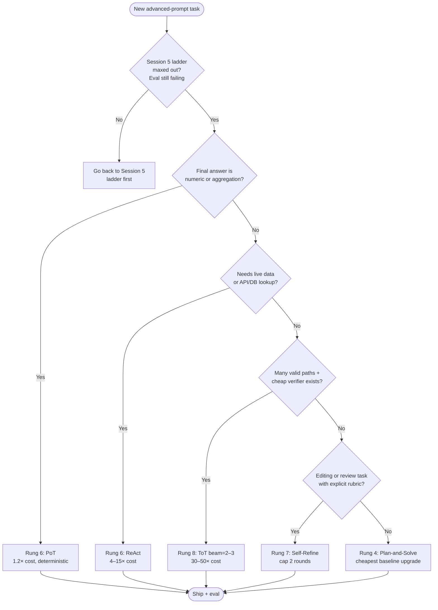

# 07 — Decision Framework: Which Advanced Technique for Which Task

**Overview:** Session 5 gave you a 5-rung ladder (Zero-shot → Few-shot → CoT → SC → Meta). Session 6 extends it to 11 rungs and adds *composition* — most production wins come from pairing two techniques, not from picking one. This page is the lookup desk: pick a rung, pick a pair, look up the cost, find the failure mode, exit when the bill exceeds the gain.

**Cross-references:** Search-based reasoning in [02-tree-of-thoughts.md](02-tree-of-thoughts.md). The 20+ secondary techniques (Step-Back, PoT, Self-Refine, ReAct, Generated Knowledge, etc.) in [06-secondary-techniques.md](06-secondary-techniques.md). The reasoning-model collapse (when these rungs become redundant) in [08-reasoning-models.md](08-reasoning-models.md). Tracing, caching, and stop conditions in [09-production.md](09-production.md).

---

## 1. The Advanced Complexity Ladder — 11 Rungs

Climb only when the current rung's eval score plateaus. Rungs 0–3 are Session 5 territory; the action starts at Rung 4.

```
Rung 0:  Zero-shot                                    ─── Session 5 territory ───
Rung 1:  Zero-shot CoT ("think step by step")
Rung 2:  Few-shot CoT (3–8 exemplars)
Rung 3:  Self-Consistency (N=5, majority vote)
──────────────────────────────────────────────────── Session 6 starts here ───
Rung 4:  Plan-and-Solve (free zero-shot upgrade, always try this first)
Rung 5:  Decompose: Least-to-Most or hand-authored prompt chain
Rung 6:  External grounding: PoT (numeric tasks) or ReAct (tool-using tasks)
Rung 7:  Self-correct: Self-Refine (1–2 rounds) or Constitutional critique
Rung 8:  Search: ToT (beam=2–3) or Reflexion (requires verifier)
Rung 9:  Compose multiple techniques into an explicit pipeline DAG
Rung 10: Switch model class: reasoning model (o1/o3, Claude thinking, Gemini thinking)
         At this rung, CoT/ToT/Plan-and-Solve are largely redundant — focus on
         Decomposition, ReAct, PoT, and Constitutional critique.
```

| Rung | Name | When to climb | Cost class (vs CoT) |
|------|------|---------------|--------------------|
| 0 | Zero-shot | Default for anything not previously solved on this task | 1× |
| 1 | Zero-shot CoT | Multi-step answer needs intermediate steps surfaced | 1.5× |
| 2 | Few-shot CoT | Format/calibration drifts across runs at Rung 1 | 1.5–2× |
| 3 | Self-Consistency | CoT answers differ across temperature samples on the same input | 5× |
| 4 | Plan-and-Solve | Rung 1 produces a correct plan but botches execution, or skips the plan entirely | 1.1× |
| 5 | Least-to-Most / Chain | Single prompt can't hold the whole task; subtasks compose into a final answer | 2–4× |
| 6 | PoT / ReAct | Answer needs arithmetic on real numbers, or live data from an API/DB | PoT 1.2× · ReAct 4–15× |
| 7 | Self-Refine / Constitutional | Output is structurally correct but quality is uneven; a rubric exists | 3–4× |
| 8 | ToT / Reflexion | Many candidate paths exist, a cheap verifier separates good from bad | ToT 30–50× · Reflexion 5–20× |
| 9 | Pipeline DAG | A single technique covers <70% of failures; orthogonal techniques cover the rest | sum of stages |
| 10 | Reasoning model | Cost of orchestrating Rungs 6–9 exceeds the thinking-token bill on o1/o3/Claude-thinking | model-dependent |

**Rung 0–3 commentary.** Covered in Session 5. The only addition relevant to Session 6: if your eval shows that Rung 3 (SC) has plateaued *and* the failures share a common structural defect (wrong arithmetic, missing data, style drift), do not raise N. Move sideways into the appropriate Rung 4+ family. SC at N=20 cannot fix a problem that needs PoT.

**Rung 4 commentary.** Plan-and-Solve is the cheapest non-trivial upgrade in this list — one extra instruction ("First devise a plan, then execute it. Solve the problem step by step.") buys +9.1pp on GSM8K (Wang 2023, arXiv:2305.04091). The plan is generated in the same call as the solution, so token overhead is only ~10%. Always try this before climbing further. The failure mode is "generic plan" — if the plan reads like a template ("First, understand the problem..."), force specificity by adding a one-shot example of a concrete plan.

**Rung 5 commentary.** Decomposition splits a single prompt into K explicit subtasks. *Least-to-Most* (Zhou 2023, arXiv:2205.10625) is automatic — the model proposes its own subproblems and solves them in order. *Hand-authored chains* are explicit — the engineer defines each step in code. Use the automatic version for exploration, hand-authored for production. Anti-pattern: 8-step chain where steps 2–7 are read-only transformations — collapse those into a single call.

**Rung 6 commentary.** This is where most production engineers should live. PoT (Chen 2023, arXiv:2211.12588) routes numeric work to an interpreter; ReAct (Yao 2022, arXiv:2210.03629) routes data-fetch work to tools. Both replace probabilistic guessing with deterministic execution. The two are orthogonal — many production pipelines use both, with PoT inside ReAct's `code_exec` tool.

**Rung 7 commentary.** Self-correct works only with a rubric. *Self-Refine* uses a free-form critic; *Constitutional critique* uses a written constitution. Both require capping at 2 rounds — round 3+ regresses on 30–40% of tasks (Madaan 2023). The signature failure mode: critic says "looks good" on round 1, refines anyway, makes it worse. Always honor "no changes needed" and stop.

**Rung 8 commentary.** Search is expensive — 30–50× a single CoT call. Pay this only when (a) you have a value function cheaper than the generator, and (b) the task admits multiple valid paths. If either is false, stop at Rung 7. ToT is the classic; *Reflexion* is its episodic cousin that persists lessons across trials. Reflexion needs an external verifier (a unit-test runner, a regex, a typed schema) — without one, it amplifies hallucinations.

**Rung 9 commentary.** A composed pipeline is a DAG of techniques with one purpose per node. Example: Step-Back → Generated Knowledge → ReAct → ToT → PoT → Self-Refine for incident RCA. The rule is *one technique per failure mode*. If you can't name the failure mode a stage addresses, delete the stage. Most production DAGs have 3–5 stages; anything beyond 7 is usually over-engineered.

**Rung 10 commentary.** A reasoning model runs its own internal CoT and search. Wrapping it in ToT pays twice. Migrate when your gpt-4o + ToT bill exceeds o1-mini's thinking-token bill on the same eval set. The migration deletes most scaffolding: no `Let's think step by step`, no SC vote, no ToT beam. Keep ReAct (the model still can't reach your APIs), PoT (it still can't run code natively in most providers), and Constitutional critique (style is your concern, not the model's).

---

## 2. Decision Shortcuts

Two heuristics let you skip rungs without iteration:

1. **Numeric task → jump to Rung 6 (PoT).** If the final answer is a number, percentage, currency value, or aggregation over a table, do not climb 1→2→3→4. Go straight to PoT. The +8.5pp on GSM8K and +24.1pp on FinQA deltas justify skipping the lower rungs entirely.
2. **Budget allows thinking tokens → jump to Rung 10.** If you have API access to o1/o3/Claude-thinking and the latency budget tolerates 5–30s thinking, skip the scaffolding. Port your Rung 0 prompt to the reasoning model and re-evaluate before building anything more elaborate.

---

## 3. Composition Rules — Pair Well

Six combinations where the synergy is greater than the sum:

1. **Plan-and-Solve + PoT.** Plan in prose ("identify variables, derive formula, compute"), then emit a Python block for the execute step. The plan keeps the model honest about what's being computed; PoT keeps the arithmetic exact.
2. **ReAct + Self-Refine.** Use ReAct to gather evidence from tools, then Self-Refine the synthesis. The act phase grounds the analysis in real observations; the refine phase enforces narrative quality. Order matters — never refine before gathering.
3. **Generated Knowledge + Step-Back.** Step back to identify the abstract category, generate domain facts about that category, then answer. Two cheap calls (2×–4× tokens) replace expensive RAG infrastructure for closed-domain commonsense.
4. **Self-Consistency + Complexity-based exemplars.** Sample N=5 chains, but only count chains with above-median reasoning length in the vote. Adds +15pp over plain SC (Fu 2023, arXiv:2210.00720) because long chains correlate with correctness on hard inputs.
5. **ToT + PoT.** Use PoT as the per-leaf evaluator. The generator proposes hypotheses in prose; the evaluator confirms each numerically by executing code. Eliminates the "bad value function" failure mode of ToT.
6. **Skeleton-of-Thought + Constitutional critique.** SoT generates parallel sections of a long doc; a constitution lints each section against your style guide before assembly. Parallelism preserves the 2.39× latency win; the critique enforces consistency across independently generated sections.

---

## 4. Composition Rules — Pair Badly

Five anti-patterns. Each has a specific cost reason or stability reason — not just "doesn't help."

1. **ToT + Self-Refine inside the same trial.** You're refining branches you may prune. Pick one: either search to find the best branch (ToT) or iterate to improve a single branch (Self-Refine). Doing both inside one request doubles cost with no measurable gain.
2. **Reflexion + Self-Refine in the same inner loop.** Both are self-critique loops. Without an external verifier breaking the cycle, the second loop reinforces the first loop's drift. Huang et al. (arXiv:2310.01798) show self-correction *degrades* accuracy without external grounding.
3. **EmotionPrompt + reasoning models.** RLHF on o1/o3/Claude-thinking has neutralized social-pressure tokens. The emotional sentence ("This is critical to my career") wastes attention budget and contributes nothing measurable. The +115% BIG-Bench effect was era-dependent — gone by 2024.
4. **ToT + reasoning models.** The reasoning model already runs internal search. Wrapping it in ToT pays for the same search twice — once in thinking tokens, once in your orchestration code. Use Decomposition, PoT, ReAct, and Constitutional critique on reasoning models; drop ToT.
5. **S2A + short focused contexts.** System-2 Attention rewrites context to remove distractors. On a 200-token focused prompt, the rewrite costs more than the noise it removes. Reserve S2A for >2K-token contexts with mixed signal.

---

## 5. Cost Lookup Table

Multipliers vs a single CoT call. Verbatim from the comparison anchor.

| Technique | Token multiplier | API call multiplier | Notes |
|-----------|-----------------|---------------------|-------|
| Plan-and-Solve | 1.1× | 1× | Free upgrade |
| Step-Back / Generated Knowledge / Faithful CoT / S2A | 2× | 2× | One extra call for the abstract/knowledge/rewrite step |
| Contrastive CoT | 2× | 1× | Tokens in pos+neg exemplars |
| Self-Refine (2 rounds) | 3–4× | 5× | gen + crit + ref + crit + ref |
| Least-to-Most / chaining | 2–4× | 1+K× | K = #subproblems |
| ReAct | 4–15× | 4–15× | One call per turn |
| ToT (b=3, d=3, k=5) | 30–50× | ~30× | Beam × depth × eval calls |
| GoT | 10–30× | varies | + operation overhead |
| Reflexion (5 trials) | 5–20× | proportional | Per-trial cost |
| PoT | ~1.2× | 2× | LLM + executor (free) |
| SoT | ~1× tokens | N+1× | N parallel calls; saves wall-clock time |
| Analogical Prompting | 2–3× | 2× | Self-generated examples in context |

**Reading this table:** at 10K requests/day with gpt-4o at $0.0025 in / $0.010 out, a single CoT call costs ~$0.005 → $50/day baseline. ToT at 40× = $2,000/day. That is the line where Rung 10 (reasoning model) becomes the cheaper option.

---

## 6. Best Accuracy/Cost Ratios — Production Priority Order

Top 5, ordered by ratio:

1. **Plan-and-Solve** — single-call upgrade, ~1.1× tokens, +9.1pp on GSM8K. Try this on every prompt before anything else.
2. **PoT** — ~1.2× tokens, +8.5pp on GSM8K, +24.1pp on FinQA. The cheapest fix for any numeric task.
3. **Step-Back** — 2× tokens, +27pp on TimeQA, +11pp on chemistry MMLU. Highest delta-per-token outside the numeric domain.
4. **Self-Refine capped at 2 rounds** — 3–4× tokens, ~+20% average gain across 7 editing/code-review tasks. The cap is non-negotiable; round 3+ usually regresses.
5. **ReAct** — 4–15× tokens, +34pp on ALFWorld. Variable cost but irreplaceable when the task needs live data.

---

## 7. Decision Flowchart



The flow is conservative on cost: it asks the cheap-upgrade questions first (numeric → PoT, tool-needed → ReAct) and only reaches ToT when both a branching task and a verifier exist.

---

## 8. Signal-to-Fix Table

Diagnose the failure before changing technique. Each row maps a symptom you'd see in MLflow traces to the technique change.

| Observable signal | Diagnosis | Technique change |
|-------------------|-----------|------------------|
| Chain step 3 fails on 18% of inputs; steps 1, 2, 4 pass | Per-step pass-rate weak link; step 3 lacks input validation | Add Pydantic validator + retry-with-feedback on step 3 (mini-Self-Refine) |
| CoT confident but wrong on financial math (decimal-place errors) | Numeric reasoning in natural language | Switch to PoT — emit Python, execute in sandbox |
| Model hallucinates an API endpoint that doesn't exist | ReAct without a tool-not-found guard | Add available-tools list to system prompt + return `Tool 'X' not found. Available: [...]` on KeyError |
| Self-Refine round 3 quality drops below round 2 | Over-refining; rubric is satisfied but model keeps editing | Hard cap at 2 rounds; stop on `judge_score` plateau (Δ < 0.02) |
| ToT picks a hypothesis that contradicts the evidence | Value function is wrong (uniform scores) | Replace LLM-judge with deterministic verifier (PoT exec, unit-test runner, linter) |
| Reflexion makes the same mistake on trial 5 as trial 1 | Reflection memory not being injected into the next trial's context | Verify `episodic_memory` is prepended to the prompt; log it as MLflow text artifact |
| ReAct loops between two tools forever | No cycle detection | Hash `(tool_name, sorted_args)` into a `seen` set; break on repeat |
| Long-context task answers based on irrelevant distractor info | Attention diluted across context | S2A rewrite, or Thread-of-Thought segmentation |
| Output style drifts across users in production | No constitution enforcing voice | Constitutional critique pass before return |
| gpt-4o + ToT pipeline costs $0.62/request, latency 22s | At the stop-and-switch threshold | Port to o1-mini; drop ToT scaffolding (see Section 10) |
| Plan-and-Solve plan is generic ("First, understand the problem...") | Plan template not anchored to task | Add a one-shot example of a concrete plan in your domain |
| Few-shot CoT exemplars are correct but inputs are off-distribution | Exemplar mismatch, not technique mismatch | Replace synthetic exemplars with real recent traffic samples |
| PoT-generated code throws on edge inputs (None, empty, NaN) | Sandbox catches it but the answer is "ERROR" | Add a one-shot example showing defensive code; or wrap in try/except in the prompt template |

---

## 9. The 3 Questions Every Advanced-Prompt Engineer Asks

Before adding a technique, answer all three. If any answer is "no" or "don't know," stop and instrument first.

1. **Which family fits?** The four families: *decompose* (Plan-and-Solve, Least-to-Most, chaining), *ground* (PoT, ReAct, Generated Knowledge), *self-correct* (Self-Refine, Constitutional, Reflexion), *search* (ToT, GoT, Maieutic). Pick the family that matches your failure mode — not the technique with the biggest published delta.
2. **Do I have a verifier?** Self-correct and search families *require* a verifier cheaper than the generator. PoT-execution, unit tests, linters, type checkers, deterministic regex, and LLM-judge with a strict rubric all qualify. Without a verifier, you are reinforcing the model's confidence on its own wrong answers (Huang 2023, arXiv:2310.01798).
3. **Am I paying twice on a reasoning model?** If you are running o1/o3/Claude-thinking, drop CoT, ToT, and most Self-Consistency. The model already runs internal search. Keep only Decomposition, ReAct, PoT, and Constitutional critique.

---

## 10. Stop & Switch — Cost Ceiling Rules

If your ToT or Reflexion run exceeds **~$0.50 per request**, do not raise the depth or beam. Switch:

1. **Draft-and-verify.** Use a cheap model (gpt-4o-mini, Haiku) for proposals and a strong model (gpt-4o, Sonnet) only for evaluation. Cuts cost ~5× with <2% accuracy drop on most tasks.
2. **Replace ToT with SC N=5.** Self-Consistency at N=5 is often within 5% of ToT(b=3, d=3) on quality and ~10× cheaper. Run the comparison on your eval set before committing to ToT.
3. **Cache the value function aggressively.** ToT's value-function calls on identical subtrees are the most cacheable component of any advanced pipeline. Key on `hash(node_state + model)`. See [09-production.md](09-production.md) for cache layout.
4. **Switch to a reasoning model (Rung 10).** Thinking tokens on o1-mini often cost less than orchestrating 30 ToT calls on gpt-4o. The migration is mechanical: strip CoT and ToT scaffolding, port the system prompt, re-evaluate.

The same logic applies to Reflexion when per-trial cost × trial count exceeds your latency or budget envelope.

---

## 11. Editorial Notes — Software-Engineer Analogies

The session uses one extended metaphor: *advanced prompting is debugging*. Each rung is a debugging tool of different fidelity and cost.

| Technique | Software-engineer analogy |
|-----------|--------------------------|
| CoT | Debugging with `print()` statements. Cheap, ubiquitous, lossy. |
| ToT | Debugging with a stepping debugger that can rewind — expensive but lets you compare branches. |
| ReAct | A REPL where the LLM is the developer and your tools are the runtime. |
| Self-Refine | Code review where the author is also the reviewer. Useful, but bring a rubric. |
| Reflexion | Self-Refine plus a team retrospective wiki that persists across sprints. |
| Step-Back | Whiteboard the algorithm's invariants before writing the code. |
| PoT | Don't ask your colleague to do mental arithmetic — ask them to write a one-liner. |
| Generated Knowledge | Rubber-duck yourself to surface latent context. |
| Skeleton-of-Thought | Outline first, then write sections in parallel — a team writing a design doc. |
| Faithful CoT | Translate to a typed language: the type checker is now the verifier. |
| Constitutional critique | A CI pipeline with a custom linter for your team's style guide. |
| Prompt chaining | Each call is a microservice with a 95% SLA. Design for retries and circuit breakers. |

The point of the analogies is to make rung-choice a five-second decision. If the failure resembles "I need a stepping debugger," reach for ToT. If it resembles "I need a CI linter," reach for Constitutional critique. The cost table determines whether you can afford it.

---

## 12. References

| Source | Used for | arXiv / link |
|--------|----------|--------------|
| Wang et al. 2023 — Plan-and-Solve | Rung 4 baseline, +9.1pp on GSM8K | arXiv:2305.04091 |
| Chen et al. 2023 — Program-of-Thoughts | Rung 6 numeric grounding, +24.1pp on FinQA | arXiv:2211.12588 |
| Yao et al. 2022 — ReAct | Rung 6 tool-use, +34pp on ALFWorld | arXiv:2210.03629 |
| Yao et al. 2023 — Tree of Thoughts | Rung 8 search, +70pp on Game-of-24 | arXiv:2305.10601 |
| Shinn et al. 2023 — Reflexion | Rung 8 alternative, +11pp HumanEval pass@1 | arXiv:2303.11366 |
| Madaan et al. 2023 — Self-Refine | Rung 7 self-correct, +20% across 7 tasks | arXiv:2303.17651 |
| Zheng et al. 2023 — Step-Back | Top-3 cost/accuracy ratio | arXiv:2310.06117 |
| Huang et al. 2023 — Self-correction limits | "Need a verifier" rule | arXiv:2310.01798 |
| Fu et al. 2023 — Complexity-based prompting | SC + complexity composition (+15pp) | arXiv:2210.00720 |
| Ning et al. 2024 — Skeleton-of-Thought | SoT + Constitutional composition | arXiv:2307.15337 |
| Chia et al. 2023 — Contrastive CoT | Negative exemplar composition | arXiv:2311.09277 |
| Weston & Sukhbaatar 2023 — System 2 Attention | S2A failure mode on short contexts | arXiv:2311.11829 |
| Besta et al. 2024 — Graph of Thoughts | GoT cost comparison | arXiv:2308.09687 |
| Comprehensive Framework research artifact | Cost table, ladder, composition rules, stop conditions | `01-research/claude-compass_artifact_*.md` |
