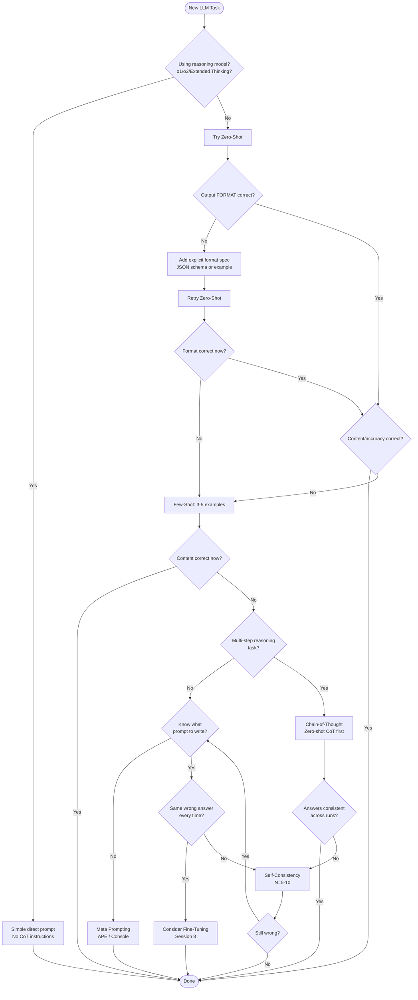

# 06 — Decision Framework: Which Technique for Which Task

**Overview:** A practical guide for choosing the right prompting technique. The central principle is the *Complexity Ladder* — start with the simplest technique and escalate only when you have eval evidence that the current level is insufficient. This is the session's primary practical takeaway.

**Cross-references:** Technique details in [03-zero-few-shot.md](03-zero-few-shot.md), [04-chain-of-thought.md](04-chain-of-thought.md), [05-self-consistency-meta.md](05-self-consistency-meta.md). Fine-tuning signal previews Session 8. [07-production.md](07-production.md) — eval infrastructure needed to make escalation decisions.

---

## The Complexity Ladder

```
                ┌─────────────────────────────────────┐
                │  FINE-TUNING (→ Session 8)          │  Accuracy ceiling + style requirements
                ├─────────────────────────────────────┤
                │  META PROMPTING (APE / OPRO)        │  Don't know what to write
                ├─────────────────────────────────────┤
                │  SELF-CONSISTENCY (N=5–10)          │  CoT answers vary significantly
                ├─────────────────────────────────────┤
                │  CHAIN-OF-THOUGHT                   │  Reasoning errors on multi-step
                ├─────────────────────────────────────┤
                │  FEW-SHOT                           │  Output format/content wrong
                ├─────────────────────────────────────┤
          START → ZERO-SHOT                           │  Always start here
                └─────────────────────────────────────┘
```

**The Rule:** Start at Zero-Shot. Only escalate when you have *evidence* — an eval score below threshold on your golden test set. Not a feeling. Not one bad output. An eval score.

**The Anti-Pattern:** Starting with Self-Consistency for everything "because it's more accurate." Cost = N× call cost. The analogy: *Would you use a 20-truck convoy to deliver one pizza?*

---

## Signal-to-Fix Mapping

Use this table to diagnose before choosing a technique. The symptom tells you the diagnosis; the diagnosis tells you the fix.

| Observable Signal | Diagnosis | Fix |
|------------------|-----------|-----|
| Output format is wrong or inconsistent (sometimes JSON, sometimes prose) | Missing or unclear format specification | Add explicit output format to system prompt (see [02-anatomy.md §Output Format](02-anatomy.md)) |
| Output format is right, but content is wrong | Missing context or examples; model using generic knowledge | Add context; escalate to few-shot |
| Few-shot content is still wrong after 3–5 examples | Input examples don't match actual distribution | Replace examples with real, diverse inputs from your task |
| Reasoning errors on multi-step tasks (model skips steps or jumps to wrong conclusion) | Model not generating intermediate reasoning | Upgrade to CoT; try zero-shot CoT first ("Let's think step by step") |
| CoT answers vary significantly across multiple runs | High-variance reasoning — model finds different paths to different answers | Upgrade to Self-Consistency (N=5–10) |
| Self-Consistency is confident but wrong | Systematic model error — model makes same wrong inference on every path | SC won't help. Check: does the same wrong reasoning appear in all outputs? → Consider fine-tuning |
| Don't know what prompt to write for a new task | No clear starting structure | Use Meta Prompting / Anthropic Console "Generate a prompt" |
| Using o1/o3/Claude Extended Thinking | CoT is built-in — explicit CoT adds cost with minimal gain (+2.9%) | Simplify prompt; don't add CoT instructions |
| Model uses wrong label names or severity definitions | Custom taxonomy not in pre-training | Add explicit definitions to zero-shot prompt (usually fixes without needing few-shot) |
| Schema compliance failing at high volume | Prose format instructions unreliable under load | Switch to Structured Outputs / Tool Use (API-enforced schema) |

---

## Task-Technique Matrix

| Task Type | Starting Technique | Escalation Path | Notes |
|-----------|-------------------|-----------------|-------|
| **Classification (standard labels)** | Zero-shot + explicit label list | Few-shot if unstable | Define all valid labels explicitly in the instruction |
| **Classification (custom/internal labels)** | Few-shot | CoT if label reasoning is complex | Use your team's real examples, not synthetic ones |
| **Data extraction → JSON** | Zero-shot + JSON schema | Few-shot if schema compliance fails | For production: use Structured Outputs / Tool Use |
| **Multi-step math / estimation** | Zero-shot CoT | SC (N=5–10) if answers vary | Story point estimation, cost projection, SLA calculation |
| **Code debugging / RCA** | CoT (structured reasoning) | SC (N=5) for high-stakes | Forces systematic elimination of causes |
| **Code review** | Few-shot + XML tags | — | Include examples of your team's review style |
| **Summarization** | Zero-shot + format spec | Few-shot if length/style wrong | Usually no escalation needed |
| **PR description generation** | Zero-shot + format spec | Few-shot | Include examples of your team's PR style |
| **Incident post-mortem** | CoT (structured) | SC (N=5) for critical incidents | Multi-step analysis: symptoms → timeline → root cause |
| **Log field extraction** | Zero-shot + JSON schema | Few-shot if coverage fails | Structured Outputs for production |
| **High-stakes decisions** | SC (N≥10) | — | Always use SC when errors are expensive |
| **Unknown task (prototyping)** | Zero-shot | Meta Prompting if stuck | Start simple; generate candidates only if unable to write prompt |

---

## Decision Flowchart (Mermaid)



---

## Worked Examples

### Example 1: Bug Severity Classification

**Scenario:** Zero-shot classifies the same bug as "High" sometimes and "Critical" other times.

**Signal:** Output content inconsistent — not format, but content (severity calibration).

**Decision path:**
1. Check: are severity definitions in the prompt? If not → add them → retry zero-shot
2. Still inconsistent after definitions? → Few-shot: add 3 examples per severity level from your real bug tracker
3. If still wrong: check example quality — are examples representative of real input distribution?
4. Result: typically stabilizes at few-shot with 3–5 good examples

**Why not CoT?** Severity classification is not a multi-step reasoning task. Format/content issue → fix with examples, not reasoning.

---

### Example 2: Story Point Estimation

**Scenario:** Zero-shot estimates vary wildly across engineers' stories. "Why does the model say 3 for this and 8 for something structurally similar?"

**Signal:** High variance on a multi-step estimation task.

**Decision path:**
1. Task is multi-step (enumerate subtasks → estimate each → sum → convert) → CoT is appropriate
2. Try zero-shot CoT: "Think through this step by step: (1) list subtasks, (2) estimate hours, (3) add complexity..."
3. Answers still vary across runs? → Self-Consistency (N=5, take median or majority)
4. Calibrate against past velocity data from your team

**Why SC?** Estimation is inherently subjective — different valid approaches can yield different answers. Majority vote converges on the most defensible estimate.

---

### Example 3: Log Field Extraction

**Scenario:** Zero-shot output format is inconsistent — sometimes JSON with correct fields, sometimes extra fields, sometimes prose.

**Signal:** Format wrong (not content).

**Decision path:**
1. Add explicit JSON schema to zero-shot: specify exact field names, types, nullability
2. Still failing? For production: switch to Structured Outputs / Tool Use (API-enforced, 100% schema compliance)
3. If content is also wrong (wrong field values): add 2–3 examples → few-shot

**Why not CoT?** Extraction is not a reasoning task — it's a mapping task. Format → schema compliance is solved by Structured Outputs. Content → examples.

---

### Example 4: Incident Root Cause Analysis (Production)

**Scenario:** Engineering team runs RCA on production incidents. Needs accuracy + repeatability. High stakes.

**Signal:** Multi-step reasoning task + high stakes → CoT + SC.

**Decision path:**
1. CoT with few-shot CoT examples (2–3 prior incidents with reasoning shown)
2. SC N=5 (incidents are high-stakes — worth 5× cost)
3. LLM-as-judge to score outputs (Session 4 connection)
4. Log results to MLflow with prompt version

**Why SC?** RCA is multi-step reasoning (symptoms → timeline → root cause). Different reasoning paths can reach the same conclusion via different evidence. SC surfaces the most supported conclusion.

---

## Technique Cost Comparison

| Technique | Relative Cost | Relative Latency | When Justified |
|-----------|--------------|-----------------|----------------|
| Zero-Shot | 1× | ~1s | Always — start here |
| Few-Shot | ~1.2× (slightly larger prompt) | ~1–2s | Format/content fails at zero-shot |
| CoT (zero-shot) | ~1.5× (longer output) | ~2–4s | Multi-step reasoning tasks |
| SC (N=5) | 5× | ~5–10s | High-variance CoT on important decisions |
| SC (N=10) | 10× | ~10–20s | High-stakes: RCA, critical bug classification |
| SC (N=40) | 40× | ~40–80s | Research/safety-critical only |
| Meta Prompting | N×M calls | Hours (iterative) | One-time investment for new task prompt |

**Cost math example:** Bug triage at N=10,000/day:
- Zero-shot: ~$2/day (100 tokens avg per call)
- SC N=5: ~$10/day
- SC N=10: ~$20/day
- Is the accuracy improvement worth $18/day ($540/month)? Use your eval score delta to decide.

---

## The Fine-Tuning Escalation Signal

Stop prompting and consider fine-tuning (Session 8) when ALL of these are true:

1. **Accuracy ceiling:** Even SC + well-structured prompts consistently fail your acceptance criteria after 2–3 weeks of prompt iteration
2. **Systematic error:** The model makes the same wrong inference repeatedly — not variance, bias
3. **High volume:** You're making enough calls that fine-tuning cost amortizes over token savings
4. **One of these applies:**
   - Irreducible style requirement: output style with 50+ nuanced rules impossible to express in context
   - Latency requirement: need very short prompts but complex behavior
   - Format guarantee: need 100% output structure compliance (fine-tune + constrained decoding)

**Preview of Session 8:** Full Prompting vs RAG vs Fine-Tuning vs Agents comparison — when each approach wins.

---

## Group Exercise (Live Session)

**Duration:** 5 minutes individual + 5 minutes group debrief

**Instructions:** Think of a real LLM task from your current work (or propose a hypothetical).
1. Apply the Signal-to-Fix table: which signal describes your current situation?
2. Apply the Complexity Ladder: which technique would you start with? Why?
3. What would you need to see (failure signal) to escalate to the next rung?

**Debrief questions:**
- Did anyone start at SC or CoT immediately? Is the cost justified?
- Did anyone choose Meta Prompting — do they have an eval set ready?
- Were there disagreements in groups about the right starting point?

---

## Editorial Notes

- **The Complexity Ladder is the session's main practical takeaway.** Repeat it at the start of Section 4, mid-section, and end. "What rung are you on?" is a practical question engineers can ask daily.
- **The cost argument is more persuasive than accuracy.** Engineers respond to "$0.05/request × 10,000/day = $500/day for SC N=10" more than abstract accuracy percentages.
- **The Mermaid flowchart** can be rendered live in a browser tab. It's a useful visual for the decision process.
- **Common mistake:** Jumping to CoT because "it's smarter." The cost argument and the "format issue vs reasoning issue" distinction are the antidote.

---

## References

| Source | Used for |
|--------|----------|
| DAIR.AI Prompt Engineering Guide | Technique recommendations by task type |
| ChatGPT deep research report | Decision tree structure, task categories |
| Comprehensive Framework report | Complexity ladder, cost comparison, escalation signals |
| Anthropic and OpenAI docs | Provider-specific escalation guidance |
